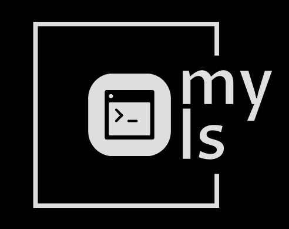
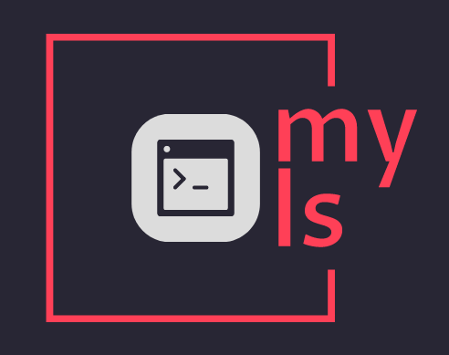

<h1 align="center">My-Ls Project</h1>

<h1 align=center>

<!--  -->


</h1>

<h2 align="center">About The Project</h2>
My-ls is a project, that consists on creating your own ls command.

## Getting Started
```console
git clone https://learn.reboot01.com/git/amali/my-ls-1.git
cd my-ls
```

## Usage
```
go run . [OPTIONS] [FILE|DIR]
```

## Examples
```
go run . -l == ls -l
go run . -r == ls -r
go run . folder/ == ls folder/
go run . -lraRt == ls -lraRt
```

## Available options

* <code>-l</code> - list with long format
* <code>-r</code> - list in reverse order
* <code>-a</code> - list all files including hidden file starting with '.'
* <code>-R</code> - list recursively directory tree
* <code>-t</code> - sort by time & date

## Additional information

Only standard go packages were in use.

## Authors

- emahfood
- amali
