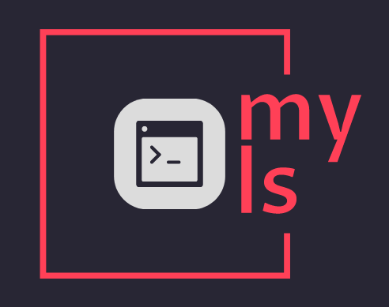

<h1 align="center">My-Ls Project</h1>


<p align="center">
    
    <!--  -->
</p>

<h2 align="center">About The Project</h2>
<h4 align="center">My-ls is a project that aims to create a custom ls command using Go.</h4>

## Getting Started
You can run the My-Ls project with the following command:
```console
git clone https://learn.reboot01.com/git/amali/my-ls-1.git
cd my-ls
```

## Usage
```
go run . [OPTIONS] [FILE|DIR]
```
#### Directory Structure:
```console
─ my-ls-1/
├── get/
│   ├── myInfo.go
│   ├── myStruct.go
│   ├── mySort.go
│   ├── CleanInput.go  
│   ├── myPrint.go
│   ├── myFlags.go
│   └── myColors.go
|
├── main.go
├── go.mod
├── README.md
└── ...
```
## Examples
Here are some examples of how to use My-Ls:

- List in long format (equivalent to ls -l):
```
go run . -l 
```
- List in reverse order (equivalent to ls -r):
```
go run . -r 
```
- List contents of a specific folder (e.g., folder/):
```
go run . folder/

```
- Combine multiple options (e.g., -lraRt):
```
go run . -lraRt
```

## Available options

* <code>-l</code> - list with long format
* <code>-r</code> - list in reverse order
* <code>-a</code> - list all files including hidden file starting with '.'
* <code>-R</code> - list recursively directory tree
* <code>-t</code> - sort by time & date

## Additional information

- Only standard go packages were in use.

## Authors

- emahfood
- amali
